# GY-511 (LSM303DLHC) 12-Point Magnetometer Calibration Guide

## How it works:

For absolute compass accuracy, your readings will form an ellipsoid that needs to be mathematically mapped back to a perfect sphere (offsetting the center to 0,0,0). Recording these 12 vector points provides the min/max table necessary to calculate the exact **X**, **Y**, and **Z** biases.

### What is an **ellipsoid**?

An ellipsoid is a three-dimensional geometric shape that looks like a squashed or stretched sphere. 

It is the 3D equivalent of an ellipse (like a rugby ball or a flattened egg), where every cross-section sliced through the shape is either an ellipse or a circle.

### why is an ellipsoid used for gyro magnetometer calibration?
An ellipsoid is used to calibrate gyro magnetometers because Earth's magnetic field is constant. In an ideal environment, rotating a 3-axis sensor forms a perfect sphere. However, sensor errors and local magnetic disturbances distort these readings into an offset and skewed 3D shape, mathematically known as an ellipsoid. Ellipsoid fitting is the mathematical method used to correct these distortions and restore accurate directional data.

The calibration process treats raw, distorted data as an ellipsoid to correct for specific hardware and environmental issues:

- **Earth's Magnetic Field:** The total magnitude of Earth's magnetic field is constant at any given location. Therefore, plotting perfect, error-free 3-axis magnetometer data in all orientations forms a perfect sphere.

- **Hard Iron Distortion:** Caused by permanent magnets or magnetized metal on the device itself (e.g., speakers, batteries, or metal chassis). This effect adds a constant offset to the sensor readings, shifting the theoretical sphere off-center.

- **Soft Iron Distortion:** Caused by the interaction of Earth's magnetic field with nearby ferromagnetic materials (e.g., iron or steel). This distorts and warps the surrounding magnetic field, stretching the ideal sphere into an asymmetrical ellipsoid.

- **Sensor Imperfections:** Manufacturing defects like scale factor errors (uneven sensitivity on each axis) and non-orthogonality (the three axes are not perfectly 90 degrees apart) further compress and tilt the shape.

With that said by rotating the magnetometer and gyroscope in multiple orientations, 
you collect a set of data points. 

Algorithms—such as **MATLAB Magnetometer Calibration** calculate the mathematical parameters of the resulting ellipsoid. 

The calibration process then generates a correction matrix that essentially shrinks, stretches, and centers the distorted ellipsoid back into a perfect, centered sphere, yielding true magnetic north and reliable attitude tracking.

## Calibration Orientations Diagram

```mermaid
graph TD
    Start[" 12 Vector Calibration Points"] --> Horizontal["Horizontal Plane\n(Tilt = 0°)"]
    Start --> TiltUp["Tilted Upward\n(Pitch +45°, Roll 0°)"]
    Start --> TiltDown["Tilted Downward\n(Pitch -45°, Roll 0°)"]

    Horizontal --> H1["Vector 1: North (0°)"]
    Horizontal --> H2["Vector 2: East (90°)"]
    Horizontal --> H3["Vector 3: South (180°)"]
    Horizontal --> H4["Vector 4: West (270°)"]

    TiltUp --> U1["Vector 5: Bearing 30°"]
    TiltUp --> U2["Vector 6: Bearing 120°"]
    TiltUp --> U3["Vector 7: Bearing 210°"]
    TiltUp --> U4["Vector 8: Bearing 300°"]

    TiltDown --> D1["Vector 9: Bearing 60°"]
    TiltDown --> D2["Vector 10: Bearing 150°"]
    TiltDown --> D3["Vector 11: Bearing 210°"]
    TiltDown --> D4["Vector 12: Bearing 300°"]

    style Start fill:#f9c,stroke:#333,stroke-width:2px
    style Horizontal fill:#bbf,stroke:#333
    style TiltUp fill:#bfb,stroke:#333
    style TiltDown fill:#fbf,stroke:#333
```
